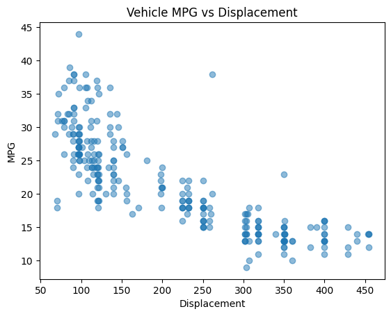

# This is the Week 3 mini project for Data Engineering
## This project includes:
* python script using Polars for descriptive statistics
* Reads a dataset from a csv file
* Generates summary statistics for that data set
* Visualizes that data by plotting two of the variables

## The script output is both summary statistics:
┌────────────┬───────────┬───────────┬──────────────┬───┬──────────────┬───────────┬──────────┬─────────────────────────┐
│ describe   ┆ mpg       ┆ cylinders ┆ displacement ┆ … ┆ acceleration ┆ year      ┆ origin   ┆ name                    │
│ ---        ┆ ---       ┆ ---       ┆ ---          ┆   ┆ ---          ┆ ---       ┆ ---      ┆ ---                     │
│ str        ┆ f64       ┆ f64       ┆ f64          ┆   ┆ f64          ┆ f64       ┆ f64      ┆ str                     │
╞════════════╪═══════════╪═══════════╪══════════════╪═══╪══════════════╪═══════════╪══════════╪═════════════════════════╡
│ count      ┆ 397.0     ┆ 397.0     ┆ 397.0        ┆ … ┆ 397.0        ┆ 397.0     ┆ 397.0    ┆ 397                     │
│ null_count ┆ 139.0     ┆ 0.0       ┆ 0.0          ┆ … ┆ 0.0          ┆ 0.0       ┆ 0.0      ┆ 0                       │
│ mean       ┆ 21.794574 ┆ 5.458438  ┆ 193.532746   ┆ … ┆ 15.555668    ┆ 75.994962 ┆ 1.574307 ┆ null                    │
│ std        ┆ 7.333658  ┆ 1.701577  ┆ 104.379583   ┆ … ┆ 2.749995     ┆ 3.690005  ┆ 0.802549 ┆ null                    │
│ min        ┆ 9.0       ┆ 3.0       ┆ 68.0         ┆ … ┆ 8.0          ┆ 70.0      ┆ 1.0      ┆ amc ambassador brougham │
│ 25%        ┆ 15.0      ┆ 4.0       ┆ 104.0        ┆ … ┆ 13.8         ┆ 73.0      ┆ 1.0      ┆ null                    │
│ 50%        ┆ 21.0      ┆ 4.0       ┆ 146.0        ┆ … ┆ 15.5         ┆ 76.0      ┆ 1.0      ┆ null                    │
│ 75%        ┆ 27.0      ┆ 8.0       ┆ 262.0        ┆ … ┆ 17.1         ┆ 79.0      ┆ 2.0      ┆ null                    │
│ max        ┆ 44.0      ┆ 8.0       ┆ 455.0        ┆ … ┆ 24.8         ┆ 82.0      ┆ 3.0      ┆ vw rabbit custom        │
└────────────┴───────────┴───────────┴──────────────┴───┴──────────────┴───────────┴──────────┴─────────────────────────┘

## And a plot of MPG vs Displacement:
