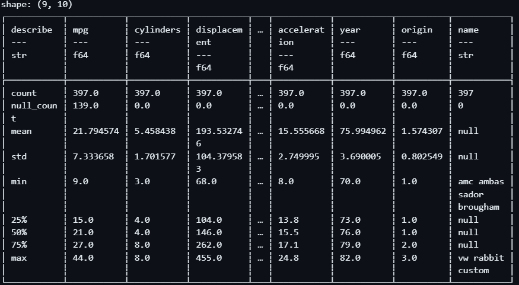

# This is the Week 3 mini project for Data Engineering
## This project includes:
* python script using Polars for descriptive statistics
* Reads a dataset from a csv file
* Generates summary statistics for that data set
* Visualizes that data by plotting two of the variables

## The script output is both summary statistics:

## And a plot of MPG vs Displacement:

